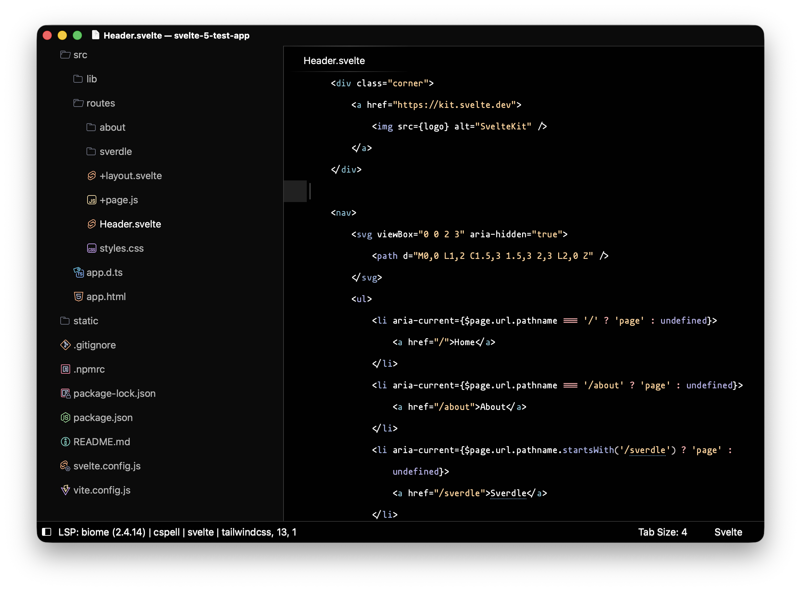

🌿 Kaputtin Mocha


## Usage

Open the command palette and select `Preferences: Settings` and set the icon theme:
```
{
    "file_icon_theme": "Catppuccin Mocha.sublime-file-icons",
}
```

If the icons look stretched in your theme do the following:
1. Open the command palette and select `UI: Customize Theme`:
```
// Documentation at https://www.sublimetext.com/docs/themes.html
{
    "variables": {},
    "rules": [
        // fix stretched icons
        {
            "class": "icon_file_type",
            "content_margin": 8
        },
    ]
}
```


## Development - Theme Generation

Install [deno](https://docs.deno.com/runtime/getting_started/installation/), a zero-config runtime for typescript.

To generate ``Catppuccin Mocha.sublime-file-icons`` run the following command:
```bash
cd src && deno run build-sublime
```

To convert svg's to png's run the following command:
```bash
cd src && deno run convert-svg-to-png
```

## 💝 Thanks to

- [catppuccin/zed-icons](https://github.com/catppuccin/zed-icons)
- [tecandrew](https://github.com/tecandrew)

